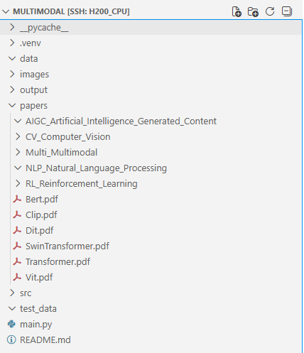
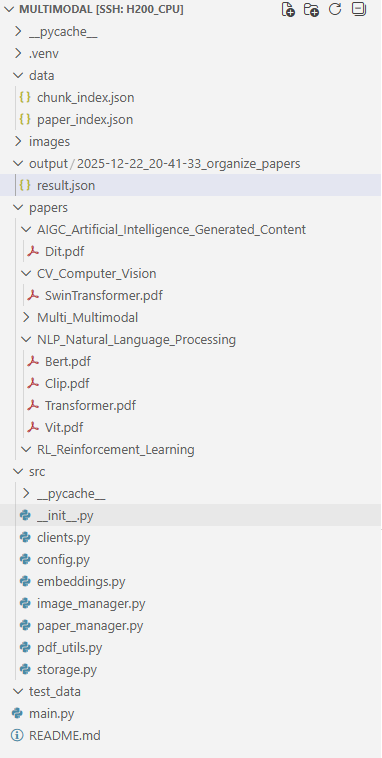
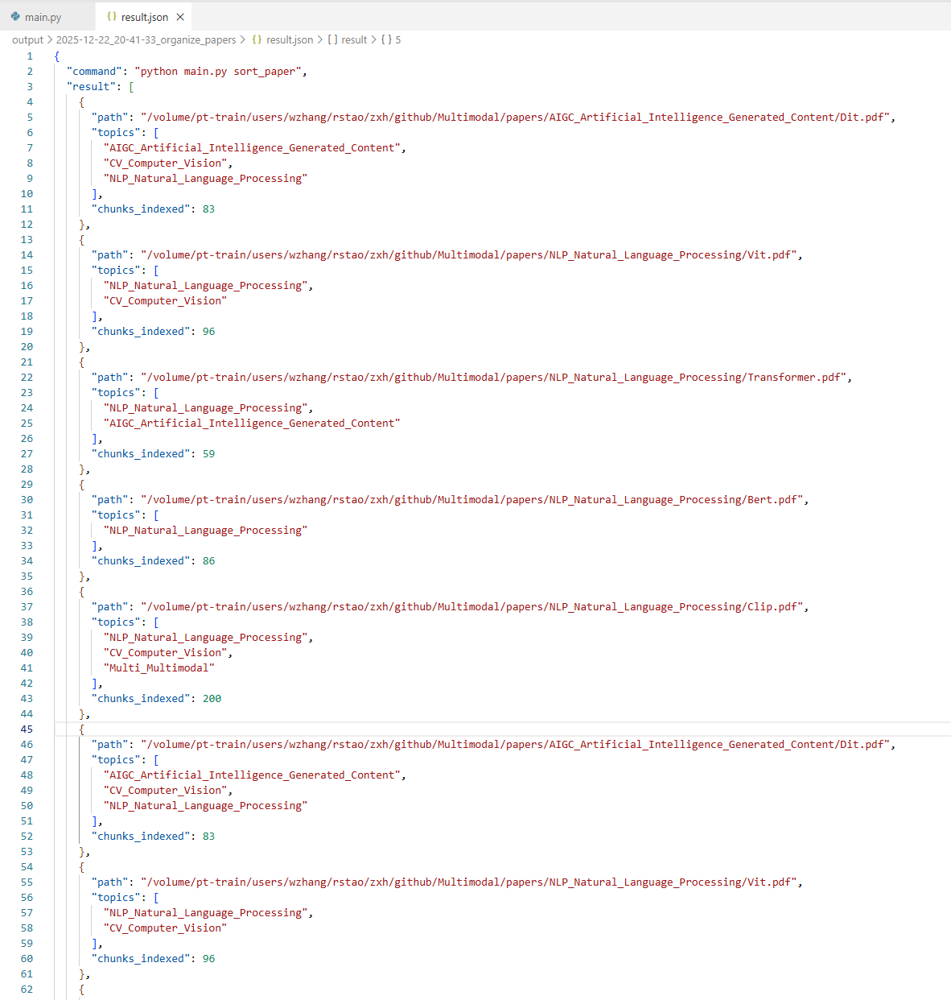
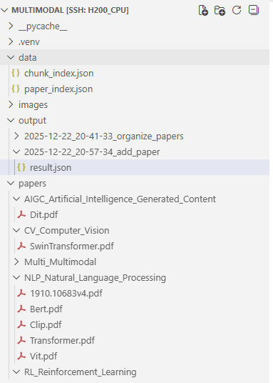
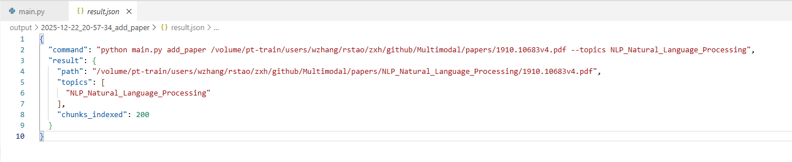
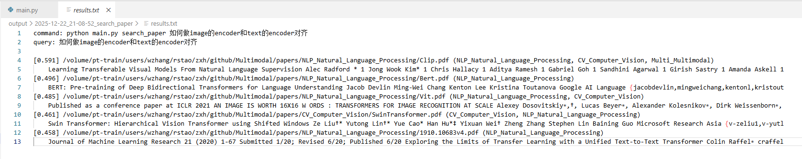
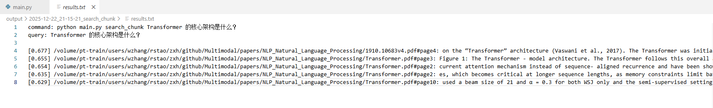
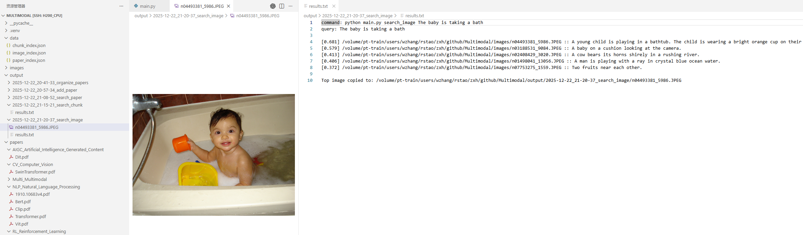

# 📖 Multimodal Manager Agent—BJTU
一个轻量的命令行工具，整合文本与多模态模型，实现论文分类/检索与以文搜图，输出可复用的索引与结果文件。

## 🚀 项目简介
- 📚 智能文献管理：自动按主题归档、语义检索整篇或片段。
- 🖼️ 智能图像管理：自动生成图片描述并支持以文搜图。
- 📂 可视化结果：所有命令输出统一写入 `output/时间戳_命令/`，便于留档。

## 🔑 核心功能
- `add_paper`: 单篇论文分类、搬运至对应主题目录并索引全文/片段。
- `sort_paper`: 一键整理 `papers/` 下所有 PDF（自动读取已有主题子目录名）。
- `search_paper`: 语义检索，支持仅输出文件列表。
- `search_chunk`: 返回最相关的论文片段（页码+文本）。
- `search_image`: 以文搜图，首次/新增图片会自动生成 caption 并补充索引，同时在输出目录拷贝最相关的那张图片。

## 🛠️ 技术选型
- 文本模型：`TEXT_MODEL`（默认 `Qwen2.5-14B-Instruct`），用于主题判别等 chat/completions。
- 文本向量：`TEXT_EMBED_MODEL`（默认 `Qwen3-embedding-8b`）。
- 多模态模型：`VISION_MODEL`（默认 `llava`）用于图片描述与图文匹配。
- 数据存储：`data/` 下 JSON 索引（paper_index.json、chunk_index.json、image_index.json）；原始文件放 `papers/`、`images/`；输出结果在 `output/`。
- 模型调用：使用`VLLM`于后端部署，修改模型`base_url`请修改`src/config.py`

## 📁 目录约定
- `papers/`：按主题子目录存放 PDF，`uncategorized/` 为默认目录。
- `images/`：图片库，支持 `.png/.jpg/.jpeg/.bmp/.gif`。
- `data/`：本地索引缓存。
- `output/`：每次命令的结果文件夹。
- `src/config.py/`: 存放模型**api**部分。 

## 🧩 环境与依赖
- Python 3.10+
- 安装依赖（示例）：`pip install openai pypdf`

## ⚙️ 配置
通过环境变量覆盖，默认示例：
- `TEXT_BASE_URL=http://172.16.206.198:8789/v1`（聊天/分类）
- `TEXT_EMBED_BASE_URL=http://172.16.206.198:8791/v1`（向量；可与 TEXT_BASE_URL 相同）
- `VISION_BASE_URL=http://172.16.206.198:8790/v1`
- `TEXT_MODEL=qwen`，`TEXT_EMBED_MODEL=qwen3-embedding-8b`，`VISION_MODEL=llava`
- `OPENAI_API_KEY=EMPTY`（如本地部署可用占位）

## 🧭 使用说明
```bash
# 单篇添加 + 指定候选主题
python main.py add_paper path/to/paper.pdf --topics "CV,NLP,RL"

# 一键整理 papers/ 根目录，自动读取已有主题子目录名
python main.py sort_paper

# 语义检索论文（仅pdf文件列表）
python main.py search_paper "Transformer是哪篇"

# 语义检索片段（含页码/chunk）
python main.py search_chunk "Transformer 的核心架构是什么？"

# 以文搜图（首次会为新图片生成 caption 并补充索引，结果目录拷贝最相关图片）
python main.py search_image "海边的日落"
```

## 📤 输出与索引
- 每次命令输出写入 `output/YYYY-MM-DD_HH-MM-SS_<command>/`，包含命令、查询、结果文本，`search_image` 会额外拷贝最相关图片。
- 索引写入 `data/`，可删除后重建；已索引文件不会重复处理，新增文件会补充索引。

## 🧭 功能演示
### 1、后端模型配置

首先我们需要配置好基础的后端模型，我本人采用`vllm`设置后端接口。

语义模型选择`Qwen2.5-14B-Instruct`、embedding模型选择`Qwen3-embedding-8b`、多模态模型选择`llava-1.5-7b`

以下为`src/config`的片段

```python
TEXT_BASE_URL = os.environ.get("TEXT_BASE_URL", "http://172.16.206.198:8789/v1")
TEXT_EMBED_BASE_URL = os.environ.get("TEXT_EMBED_BASE_URL", os.environ.get("TEXT_BASE_URL", "http://172.16.206.198:8791/v1"))
VISION_BASE_URL = os.environ.get("VISION_BASE_URL", "http://172.16.206.198:8790/v1")
API_KEY = os.environ.get("OPENAI_API_KEY", "EMPTY")
```

### 2、批量整理功能

项目的`papers`文件夹下初始整理了很多领域的文件夹名，如有其它领域的可以自己添加。

并且可以看到我在papers文件夹里面放了几篇比较著名的paper，它们现在并没有被归类到自己的领域内。



接下来在命令行输入指令`python main.py sort_paper`

命令行输出过程结果的目录


- 并且chunk和paper都被存储到`data`中

- 输出结果在`output`中

- `papers`中的pdf会被分类



result.json中会有详细的topics内容，因为有些论文属于多个topics，多余存储浪费硬盘空间，所以只放到相似度最大的里面了。



### 3、单篇添加+指定主题

这个路径下的论文是google的T5

`/volume/pt-train/users/wzhang/rstao/zxh/github/Multimodal/papers/1910.10683v4.pdf`

以下输入指令

`python main.py add_paper /volume/pt-train/users/wzhang/rstao/zxh/github/Multimodal/papers/1910.10683v4.pdf --topics "NLP_Natural_Language_Processing"`

- 可以看到这篇论文已被正常归类
- 并且其chunk和paperId都已被存入data





### 4、语义检索论文（仅pdf文件列表）

命令行输入

`python main.py search_paper "如何做image的encoder和text的encoder对齐"`

可以看到返回的结果，匹配的Top5 papers，第一篇是Clip也符合想要的结果，效果不错



### 5、语义检索论文片段(页数)

命令行输入

`python main.py search_chunk "Transformer 的核心架构是什么？"`

可以看到返回的结果，最匹配的Top5个chunk，第一个chunk比较符合结果，在论文的第4页。但实话说，我做了多次检索，这个chunk检索的效果一般，估计和划分策略这些有关，没有按照语义，暴力的token划分有点问题。



### 6、文搜图

每次进行文搜图的时候会检索有没有新的图片加进来，全都添加到`data/image_index.json`里面。

命令行输入

`python main.py search_image "The baby is taking a bath"`

- 生成的output里面有`png`即想要找到的图
- 最符合的Top5个图片，以及llava生成的它们对应的描述，效果还是不错的。



### 7、完整的结果展示

以上所有的输出结果我都保存在output中没有删除，可以看到具体的输出。